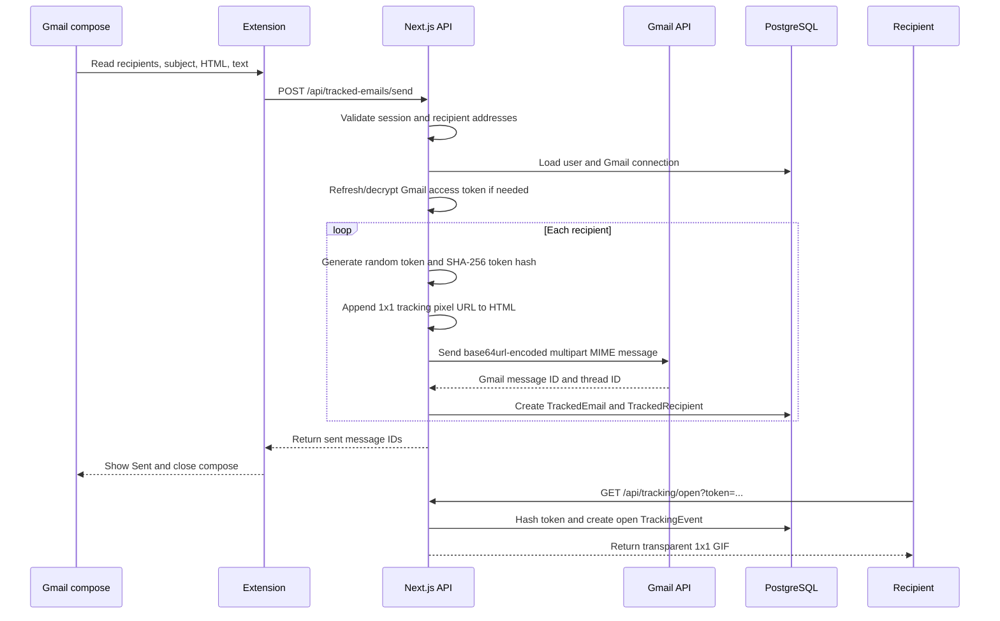
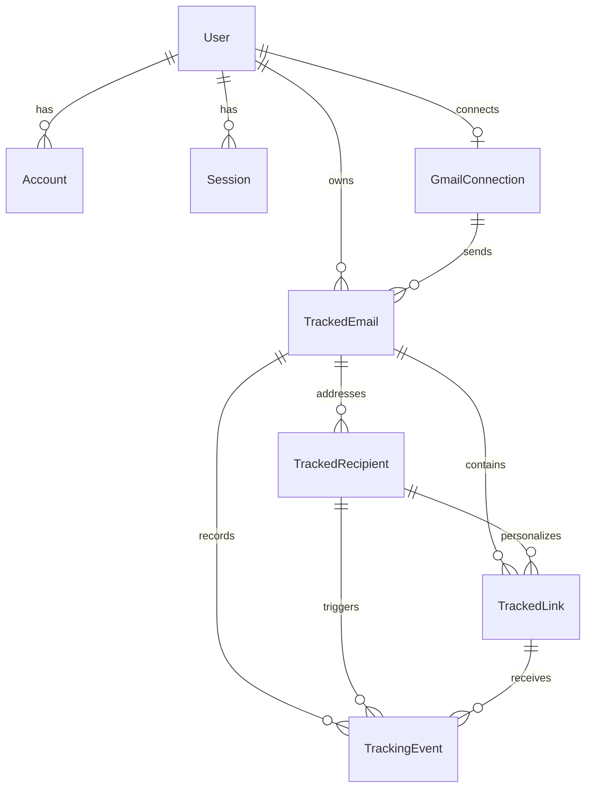
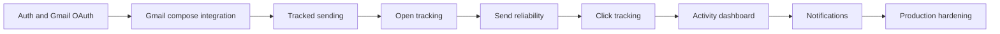

# Mailaro

Mailaro is a Gmail companion for understanding what happens after an important email leaves your outbox. It combines a Next.js web application, a PostgreSQL database, and a Chrome Manifest V3 extension for Gmail compose windows.

The repository is an early prototype. Google sign-in, Gmail OAuth connection, the dashboard shell, compose detection, per-recipient tracked sending, and the first open-pixel endpoint are implemented. Click tracking, activity views, notifications, and production hardening remain ahead.

## Product goal

The first release should let a user:

1. Sign in with Google and connect Gmail.
2. Open a Gmail compose window and choose whether to track a message.
3. Send one tracked copy per recipient.
4. Record an open event when the recipient's mail client requests the tracking pixel.
5. View useful open and click activity in the Mailaro dashboard.

Tracking must be used transparently and in accordance with applicable laws, workplace policies, and recipient expectations.

## Architecture

```mermaid
flowchart LR
    User[User] --> Web[Next.js web app]
    User --> Gmail[Gmail]
    Extension[Chrome MV3 extension] --> Gmail
    Extension -->|Authenticated POST| SendAPI[/api/tracked-emails/send]
    Web --> Auth[NextAuth Google provider]
    Web --> OAuth[Gmail OAuth routes]
    Web --> DB[(PostgreSQL via Prisma)]
    SendAPI --> GmailAPI[Gmail REST API]
    SendAPI --> DB
    Recipient[Recipient mail client] -->|Loads 1x1 pixel| OpenAPI[/api/tracking/open]
    OpenAPI --> DB
```

### Runtime boundaries

- **Web app and API**: `apps/web` is a Next.js App Router application using React, TypeScript, Tailwind CSS, NextAuth, and Prisma. It serves the public pages, authenticated dashboard, OAuth callbacks, tracked-send API, and tracking endpoints.
- **Chrome extension**: `apps/extension` is a Manifest V3 extension. `content-v2.js` observes Gmail's changing DOM, finds compose windows, reads recipients/subject/body, adds tracking controls, and sends a payload through the background service worker.
- **Database**: `packages/db` owns the Prisma client and PostgreSQL schema. The database stores users, auth sessions, Gmail credentials, tracked messages, recipients, links, and tracking events.
- **Gmail**: Gmail OAuth is used to obtain a user-authorized access token. The server calls the Gmail REST API to send a MIME message; provider tokens are not held by the extension.
- **Future asynchronous processing**: notifications and heavier event processing are intended to move behind a queue/worker when the product needs them. Redis/BullMQ is documented as a future option, but is not currently running in this repository.

## Tracked-send flow

The current tracked-send path is implemented as follows:



Important prototype behavior:

- The extension's native Gmail **Send** button is not replaced. The separate **Send tracked** control invokes the Mailaro flow.
- Each recipient receives a separate Gmail API message and a separate random token.
- Only a SHA-256 hash of the open token is stored in `TrackedRecipient.tokenHash`; the raw token is placed in the outgoing pixel URL.
- The open endpoint is intentionally fast and returns a cached-disabled transparent GIF. It records the request's user agent and source (`pixel`).
- `TrackingEvent.eventId` is unique in the schema. The current open endpoint generates a new UUID for each request, so retry deduplication and self-open filtering are still follow-up work.

## Data model



Core schema details in `packages/db/prisma/schema.prisma`:

- `User`, `Account`, and `Session` support database-backed NextAuth sessions.
- `GmailConnection` is separate from NextAuth's provider `Account`, allowing Gmail permissions and token lifecycle to be managed independently.
- `TrackedEmail` records the Gmail message ID, thread ID, sender, subject, send time, owner, connection, and `tracked`/`untracked`/`disabled` state.
- `TrackedRecipient` stores one recipient identity and one unique token hash per message.
- `TrackedLink` is ready for per-recipient link rewriting and click redirects.
- `TrackingEvent` supports `open` and `click`, references the message and recipient, optionally references a link, and stores event time, user agent, and source.
- Foreign keys cascade when a user, Gmail connection, message, or recipient is deleted. Query indexes cover message history, recipient history, and event type/time.

## Authentication and token security

There are two related authentication flows:

1. **Application sign-in** uses NextAuth's Google provider with a database session strategy and the Prisma adapter.
2. **Gmail connection** uses a separate OAuth flow at `/api/gmail/connect` and `/api/gmail/callback`. The OAuth state is random, hashed, stored in a cookie, and compared with a timing-safe check before the connection is saved.

Gmail access and refresh tokens are encrypted using AES-256-GCM in `apps/web/src/lib/token-crypto.ts`. The encryption key is derived from `TOKEN_ENCRYPTION_KEY`, falling back to `NEXTAUTH_SECRET`. `gmail-api.ts` decrypts a still-valid access token or refreshes it with Google and stores the new encrypted access token.

The extension does not receive Gmail refresh tokens. Its background service worker forwards the tracked-send request to the local web API using the browser session cookie.

## API surface

| Route | Method | Purpose | Status |
| --- | --- | --- | --- |
| `/api/auth/[...nextauth]` | NextAuth handlers | Google sign-in and database sessions | Implemented |
| `/api/gmail/connect` | GET | Start Gmail OAuth | Implemented |
| `/api/gmail/callback` | GET | Validate OAuth state and save connection | Implemented |
| `/api/gmail/disconnect` | GET | Remove the Gmail connection | Implemented |
| `/api/tracked-emails` | POST | Allocate tracked-email and recipient records | Prototype path |
| `/api/tracked-emails/send` | POST | Build MIME messages, add pixels, send through Gmail, persist records | Implemented prototype |
| `/api/tracking/open` | GET | Resolve an open token and return a 1x1 GIF | Implemented prototype |
| `/api/tracking/open/[token]` | GET | Reserved/alternate tracking route surface | Under development |
| `/api/tracked-emails` | GET | List tracked activity for the dashboard | Next step |

The tracked-send request accepts `recipients`, `subject`, `bodyHtml`, and `bodyText`. The server limits recipients to 100 and validates message sizes before sending. It escapes plain-text fallback content, sanitizes MIME header line breaks, and encodes the final MIME message with base64url for Gmail's `messages.send` endpoint.

## Repository layout

```text
apps/
  web/
    src/app/              Pages and App Router API routes
    src/lib/              NextAuth, Gmail OAuth/API, and token crypto helpers
    public/                Static web assets
  extension/
    manifest.json         Manifest V3 permissions and entrypoints
    content-v2.js         Gmail compose detection and controls
    background.js         Service worker request bridge
    content.css           Compose control styling
packages/
  db/
    index.js              Shared Prisma client package
    prisma/schema.prisma  PostgreSQL data model
  types/                  Shared types package placeholder
docs/
  architecture.md         System responsibilities and boundaries
  release_boundaries.md   First-release product scope
  technology_stack.md     Intended stack and hosting decisions
test/
  schema.test.js          Schema and event foundation checks
```

## Local development

### Requirements

- Node.js 20 or newer
- npm
- PostgreSQL, locally or through Supabase
- A Google Cloud OAuth client configured for the local app
- Chrome, for testing the extension

Install dependencies from the repository root:

```bash
npm install
```

Create `.env` at the repository root. The current code expects these values:

```dotenv
DATABASE_URL="postgresql://..."
DIRECT_URL="postgresql://..."
NEXTAUTH_URL="http://localhost:3000"
NEXTAUTH_SECRET="replace-with-a-long-random-secret"
GOOGLE_CLIENT_ID="...apps.googleusercontent.com"
GOOGLE_CLIENT_SECRET="..."
TOKEN_ENCRYPTION_KEY="replace-with-a-long-random-secret"
TRACKING_BASE_URL="http://localhost:3000"
```

`TOKEN_ENCRYPTION_KEY` can fall back to `NEXTAUTH_SECRET`, but using a separate key is preferable. Keep all secrets out of Git. Configure the Google OAuth redirect URIs to include:

```text
http://localhost:3000/api/auth/callback/google
http://localhost:3000/api/gmail/callback
```

Generate the Prisma client, apply the current schema, and start the web app:

```bash
npm run db:generate
npm run db:push
npm run dev
```

Open [http://localhost:3000](http://localhost:3000), sign in, and connect Gmail before testing tracked sending.

### Load the extension

1. Open `chrome://extensions`.
2. Enable **Developer mode**.
3. Select **Load unpacked**.
4. Choose `apps/extension`.
5. Open Gmail and refresh the page.

The current manifest permits Gmail and `http://localhost:3000`. The extension uses Gmail DOM selectors, so Gmail UI changes may require updates to `content-v2.js`.

## Commands

Run these from the repository root:

```bash
npm run dev          # Start Next.js in development mode
npm run lint         # Lint apps/web
npm run test         # Run schema and event foundation checks
npm run check        # Run lint and tests
npm run db:generate  # Generate the Prisma client
npm run db:push      # Apply the Prisma schema to the configured database
```

The root `extension:check` script currently points at `apps/extension/content.js`; the active content script is `content-v2.js`, so that check should be corrected as part of extension tooling work.

## Current status

### Working now

- Next.js App Router web application
- Google sign-in through NextAuth and Prisma
- Database-backed application sessions
- Gmail OAuth connect/disconnect flow
- Encrypted Gmail access and refresh token storage
- Gmail access-token refresh
- Gmail compose detection with a tracking toggle and saved default
- Separate **Send tracked** compose action
- Per-recipient token generation
- MIME `text/plain` and `text/html` message construction
- Gmail API send integration
- Open pixel URL generation and open event persistence
- Prisma schema for future click events and dashboard queries

### Known prototype limitations

- The dashboard does not yet show tracked-message history or event timelines.
- The normal Gmail Send action remains untracked.
- Link rewriting and click redirect handling are not implemented end to end.
- Open events are not yet deduplicated by recipient/message/request fingerprint.
- Self-opens, image proxy behavior, bot traffic, and privacy controls need an explicit policy.
- The tracked-send loop can partially send a recipient list before returning an error; it needs transaction/reconciliation behavior.
- There is no background worker, queue, browser notification, or email notification service yet.
- The extension is plain JavaScript and is not currently bundled with Vite or TypeScript.
- Rate limiting, webhook/abuse protections, structured logging, and production deployment configuration are incomplete.

## What's next

The recommended implementation order is:

1. **Make sending reliable**: reconcile partial Gmail sends, persist provider errors, add request IDs, and make retries safe.
2. **Finish open tracking**: define duplicate/self-open policy, add retention rules, and expose first-open, last-open, and count queries.
3. **Add click tracking**: create per-link tokens, rewrite only safe HTTP(S) links, add a redirect endpoint, preserve the destination, and record click events.
4. **Build the activity dashboard**: list sent messages, show recipient-level status, and render an event timeline from database queries.
5. **Add notifications**: introduce a worker/queue only when event volume or delivery latency requires it; then support first-open and first-click notifications.
6. **Harden the extension**: replace brittle selectors with tested fixtures, support multiple compose windows, expose useful error states, and add a proper build/check pipeline.
7. **Prepare production**: configure rate limits, monitoring, token rotation, data deletion, deployment environments, OAuth verification, and privacy documentation.

### Roadmap status

| Area | Status | What it means |
| --- | --- | --- |
| Google sign-in and Gmail OAuth | Complete | Users can authenticate, connect Gmail, refresh tokens, and disconnect the account. |
| Gmail compose integration | Prototype | The extension detects compose windows and exposes tracking controls. |
| Tracked sending | Prototype | The separate **Send tracked** action sends per-recipient MIME messages with open pixels. |
| Open tracking | Prototype | The pixel endpoint validates hashed tokens and records open events. |
| Send reliability | Next | Add partial-send reconciliation, provider error records, request IDs, and safe retries. |
| Click tracking | Next | Rewrite safe links, redirect through Mailaro, and record click events. |
| Activity dashboard | Next | Add message history, recipient status, summaries, and event timelines. |
| Notifications | Planned | Add first-open and first-click notifications through an asynchronous worker when needed. |
| Production hardening | Planned | Add rate limiting, monitoring, retention/deletion controls, OAuth verification, and deployment configuration. |



For the original system boundaries and release decisions, see [docs/architecture.md](docs/architecture.md), [docs/release_boundaries.md](docs/release_boundaries.md), and [docs/technology_stack.md](docs/technology_stack.md). The extension-specific behavior is documented in [apps/extension/README.md](apps/extension/README.md).
